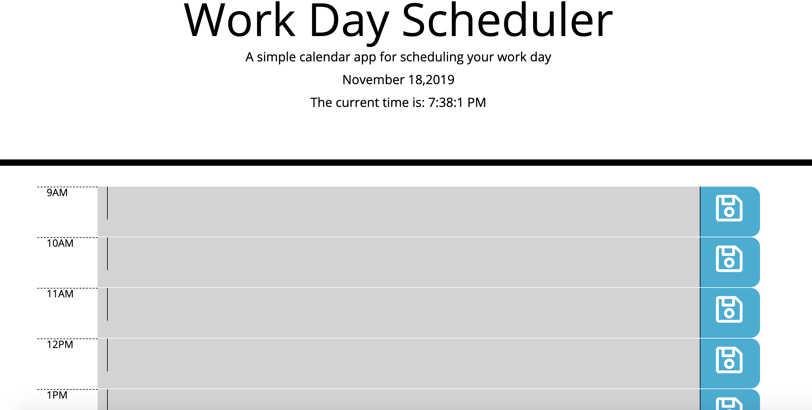
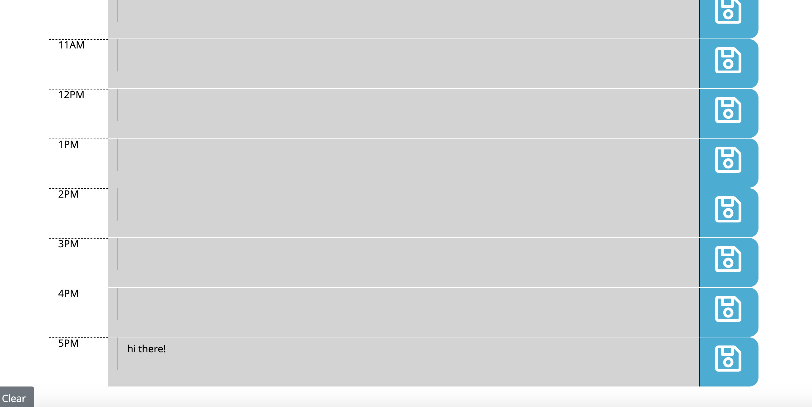

## Day scheduler

## Description
I have created a simple calendar application that allows the user to save events for each hour of the day. This app will run in the browser and feature dynamically updated HTML and CSS powered by jQuery.
The application will show regular business hours from 9AM-5PM and in each time slot represents one hour.

## Business Context
A daily planner allows employees to see their day at a glance, schedule time effectively, and improve productivity. We have all been there before missing out on small tasks to complete each day and finding out too late it is the worse. This app will be able to help you out to never miss out.

## Credits
One website that I happen to use quite a bit to execute this portfolio is https://www.w3schools.com/html/. Your more than welcome to use them. Also https://www.freecodecamp.org/ has alot of material that helped out. https://getbootstrap.com/ Really helped me alot as well.

## Submission on BCS

* https://github.com/AlexPR704/scheduler.git
* https://alexpr704.github.io/scheduler/

## License
MIT License

Copyright (c) [2019] [Alexander Garcia]

Permission is hereby granted, free of charge, to any person obtaining a copy
of this software and associated documentation files (the "Software"), to deal
in the Software without restriction, including without limitation the rights
to use, copy, modify, merge, publish, distribute, sublicense, and/or sell
copies of the Software, and to permit persons to whom the Software is
furnished to do so, subject to the following conditions:

The above copyright notice and this permission notice shall be included in all
copies or substantial portions of the Software.

THE SOFTWARE IS PROVIDED "AS IS", WITHOUT WARRANTY OF ANY KIND, EXPRESS OR
IMPLIED, INCLUDING BUT NOT LIMITED TO THE WARRANTIES OF MERCHANTABILITY,
FITNESS FOR A PARTICULAR PURPOSE AND NONINFRINGEMENT. IN NO EVENT SHALL THE
AUTHORS OR COPYRIGHT HOLDERS BE LIABLE FOR ANY CLAIM, DAMAGES OR OTHER
LIABILITY, WHETHER IN AN ACTION OF CONTRACT, TORT OR OTHERWISE, ARISING FROM,
OUT OF OR IN CONNECTION WITH THE SOFTWARE OR THE USE OR OTHER DEALINGS IN THE
SOFTWARE.